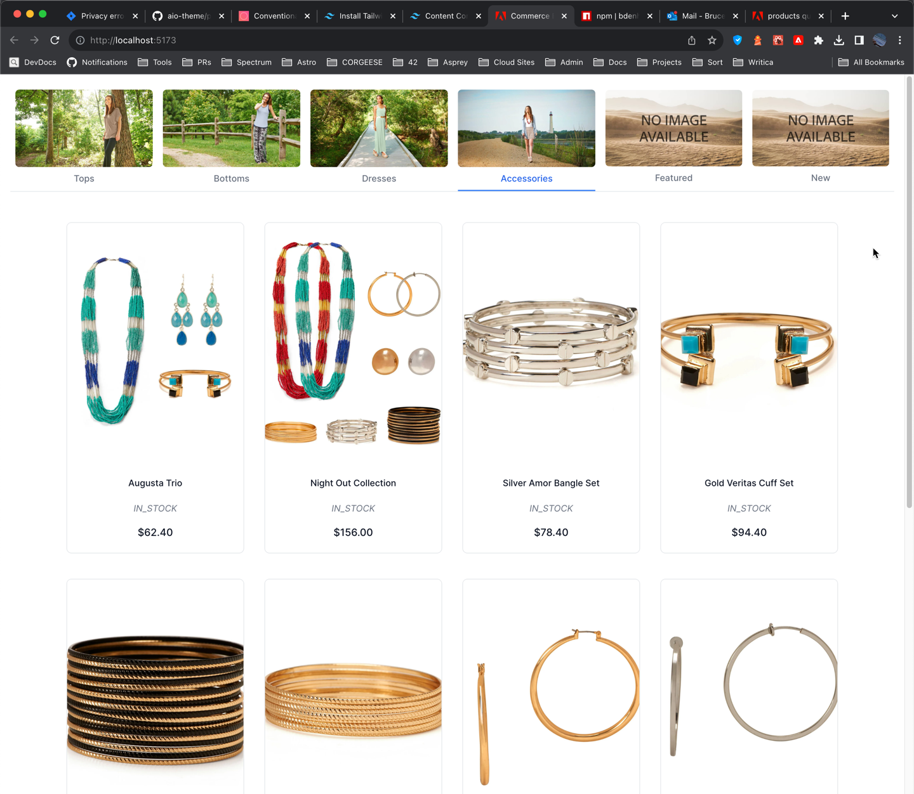

# API queries from Adobe Commerce

This package contains the Adobe Commerce GraphQL `Products` queries used to fetch the product categories, product lists, and product details shown in the example React storefront. 

## Products queries used

These links will take you to the docs for the queries used:

- `categories` query: <https://developer.adobe.com/commerce/webapi/graphql/schema/products/queries/categories/>
- `products` query: <https://developer.adobe.com/commerce/webapi/graphql/schema/products/queries/products/>

## Storefront usage

The React storefront demo (shown below) uses the `categories` query to fetch the product categories and the `products` query to fetch the product lists and product details.

